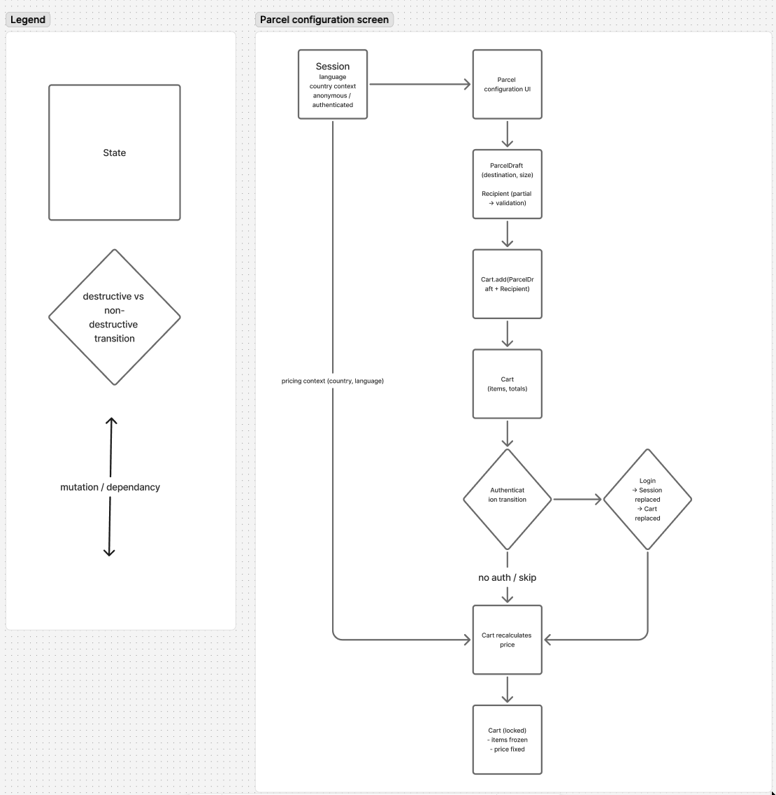

# QA Engineer – Product Quality Challenge

This repository contains my submission for the **GLS/NXT Product Quality Challenge**.

The exercise was intentionally time-boxed and exploratory in nature.  
The goal was not exhaustive test coverage, but to demonstrate how I approach product quality, risk identification, and decision-making under real-world constraints.

## Repository structure

- `qa-engineer.md`  
  The original challenge description and instructions as provided.

- `product-quality-analysis.md`  
  My exploratory testing notes, risk analysis, and reflections based on hands-on exploration of the live GLS parcel configuration and checkout flow.

- `flow-sketch.png`  
  A simplified data-flow sketch visualizing session, cart, and authentication state transitions across the parcel configuration and checkout flow, used to highlight high-risk, destructive vs non-destructive state changes.

## Scope and constraints

- Timebox: ~2–3 hours
- Role: single QA engineer
- Access: black-box testing only (no backend code or internal documentation)
- Environment: production system
- Payments: no real payments were completed

The focus was on identifying realistic risks affecting:

- revenue
- customer trust
- operational reliability

## Approach

- Rapid end-to-end exploration of the configuration → cart → checkout flow
- Risk-based prioritization instead of exhaustive coverage
- Emphasis on late-stage validation, state continuity, eligibility rules, and pricing integrity
- Notes captured during exploration and later structured into cohesive risk areas

## Data flow & state transition sketch

As a final consolidation step, I created a lightweight data-flow sketch to make the most critical state transitions explicit and easier to reason about as a team.

The sketch focuses on **state ownership and mutation**, not UI screens. It models how session context, parcel drafts, cart state, and authentication interact across the configuration and checkout flow, with particular attention to destructive vs non-destructive transitions.

Creating this sketch helped validate and communicate one of the highest-risk behaviors observed during exploration:

- logging into an existing account replaces the current (guest) cart, causing previously added parcels to disappear
- while this behavior is explicitly warned in the UI, it still represents a significant conversion and trust risk when users log in late in the flow

The intent of the sketch is shared understanding rather than architectural precision. It serves as a visual reference that can support discussions with developers, product, or QA about where state is fragile, where validation is deferred, and where changes are most likely to impact revenue and user trust.

_Simplified data-flow sketch highlighting state ownership and destructive vs non-destructive transitions during parcel configuration and checkout._

https://www.figma.com/board/ozV39pk9AXyg40L4YcXhhd/GLS-NXT-flow?node-id=0-1&t=gTA92Pdu2KJZV1uY-1

## Use of tools

AI tools (ChatGPT) were used as a **thinking and structuring aid**, not as a source of system knowledge.  
All conclusions are based on direct observation of the product behavior.

Further details on tool usage and trade-offs are documented in `product-quality-analysis.md`.

---

This submission is intentionally concise and reflective of how I would approach quality analysis when joining an existing, production-critical product team.
